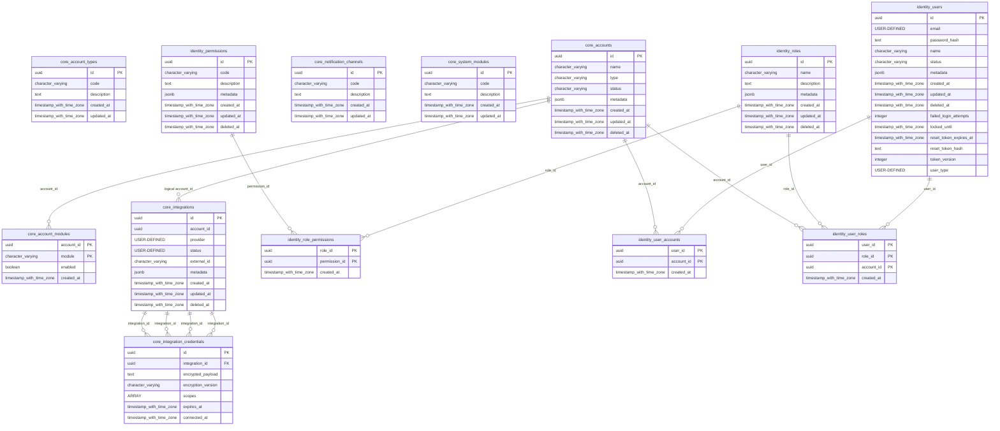
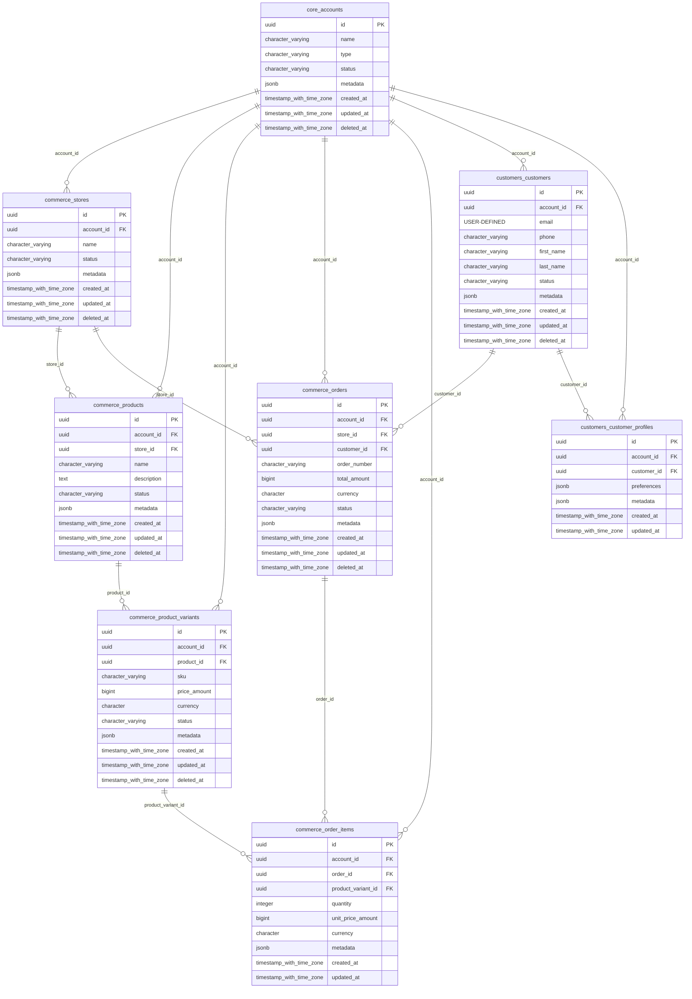

# Mermaid Diagrams

## Diagram 1 — Platform Architecture Overview

```mermaid
flowchart TD

---

  subgraph PUBLIC["public schema (Foundation)"]
    CORE["Core Infrastructure"]
    IDENTITY["Identity & RBAC"]
    CUSTOMER["Customer"]
    COMMERCE["Commerce"]
  end

---

  subgraph FIT["fit schema (Fit Intelligence)"]
    FIT_ENGINE["Engine Core"]
    FIT_GOV["Governance"]
    FIT_EXP["Experimentation"]
    FIT_REPLAY["Replay & Recovery"]
    FIT_SHOPIFY["Shopify Integration"]
    FIT_ADMIN["Admin"]
  end

---

  CORE --> CUSTOMER
  CORE --> COMMERCE
  CORE --> IDENTITY
  CORE -.->|account_id ref| FIT_ENGINE

---

  FIT_ENGINE --> FIT_GOV
  FIT_ENGINE --> FIT_EXP
  FIT_ENGINE --> FIT_REPLAY
  FIT_ENGINE --> FIT_SHOPIFY
  FIT_ADMIN --> FIT_ENGINE
```

---

## Diagram 2 — Core & Identity ER Diagram


---

## Diagram 3 — Commerce & Customer ER Diagram


---

## Diagram 4 — Fit Schema Full ER Diagram

```mermaid
erDiagram
  core_integration_credentials {
    uuid id PK
    uuid integration_id FK
    text encrypted_payload
    character_varying encryption_version
    ARRAY scopes
    timestamp_with_time_zone expires_at
    timestamp_with_time_zone connected_at
  }

  core_integrations {
    uuid id PK
    uuid account_id
    USER-DEFINED provider
    USER-DEFINED status
    character_varying external_id
    jsonb metadata
    timestamp_with_time_zone created_at
    timestamp_with_time_zone updated_at
    timestamp_with_time_zone deleted_at
  }

  fit_admins {
    uuid id PK
    character_varying email
    character_varying password
    timestamp_without_time_zone created_at
    timestamp_without_time_zone updated_at
  }

  fit_analytics_events {
    uuid id PK
    text event_type
    jsonb payload
    timestamp_with_time_zone created_at
  }

  fit_audit_logs {
    uuid id PK
    character_varying actor
    character_varying action
    character_varying entity_type
    character_varying entity_id
    jsonb metadata
    timestamp_with_time_zone created_at
  }

  fit_automation_reviews {
    uuid id PK
    uuid account_id
    text external_product_id
    uuid fingerprint_id
    text status
    text priority
    numeric confidence
    text conflict_description
    jsonb explanation
    text reviewer_id
    timestamp_with_time_zone reviewed_at
    text review_notes
    text governance_reason
    boolean requires_recovery
    timestamp_with_time_zone created_at
    timestamp_with_time_zone updated_at
  }

  fit_experiment_assignments {
    uuid id PK
    uuid experiment_id
    uuid profile_id
    uuid account_id
    character_varying variant
    character_varying assignment_hash
    timestamp_with_time_zone created_at
  }

  fit_experiments {
    uuid id PK
    character_varying name
    text description
    character_varying status
    integer traffic_percentage
    jsonb variant_config
    timestamp_with_time_zone start_at
    timestamp_with_time_zone end_at
    uuid account_id
    timestamp_with_time_zone created_at
    timestamp_with_time_zone updated_at
  }

  fit_feature_flags {
    uuid id PK
    character_varying key
    text description
    boolean enabled
    integer rollout_percentage
    character_varying scope
    uuid account_id
    jsonb config
    timestamp_with_time_zone created_at
    timestamp_with_time_zone updated_at
  }

  fit_feedback_events {
    uuid id PK
    uuid recommendation_id FK
    uuid account_id
    uuid product_id
    boolean purchased
    boolean returned
    boolean exchanged
    text fit_feedback
    timestamp_with_time_zone created_at
  }

  fit_feedback_hooks {
    uuid id PK
    uuid recommendation_id
    uuid account_id
    uuid product_id
    uuid fingerprint_id
    text event_type
    text recommended_size
    text actual_outcome
    text signal_strength
    timestamp_with_time_zone occurred_at
  }

  fit_fingerprint_versions {
    uuid id PK
    uuid fingerprint_id
    uuid account_id
    uuid product_id
    text external_product_id
    text version
    jsonb fingerprint_data
    text classifier_version
    text lineage_reason
    text severity
    timestamp_without_time_zone generated_at
  }

  fit_governance_audit_events {
    uuid id PK
    uuid account_id
    uuid product_id
    text entity_id
    character_varying entity_type
    character_varying event_type
    character_varying event_schema_version
    text governance_reason
    text actor
    uuid correlation_id
    uuid causation_id
    character_varying source_service
    jsonb metadata
    timestamp_with_time_zone occurred_at
  }

  fit_governance_incidents {
    uuid id PK
    uuid account_id
    uuid product_id
    character_varying incident_type
    character_varying severity
    character_varying title
    text description
    character_varying status
    uuid correlation_id
    jsonb metadata
    timestamp_with_time_zone occurred_at
    timestamp_with_time_zone resolved_at
    text resolved_by
    text resolution_reason
  }

  fit_lineage_snapshot_pointers {
    uuid account_id PK
    text external_product_id PK
    uuid active_version_id FK
    boolean is_quarantined
    text governance_reason
    timestamp_without_time_zone updated_at
  }

  fit_operator_roles {
    uuid id PK
    uuid admin_id FK
    character_varying role
    timestamp_with_time_zone created_at
    timestamp_with_time_zone updated_at
  }

  fit_processed_webhooks {
    text webhook_id PK
    text topic
    text shop_domain
    timestamp_without_time_zone processed_at
  }

  fit_products {
    uuid id PK
    uuid account_id FK
    text name
    text category
    text fit_type
    text stretch_level
    jsonb override_size_chart
    jsonb metadata
    timestamp_with_time_zone created_at
  }

  fit_profile_learning_states {
    uuid id PK
    uuid profile_id
    uuid account_id
    integer successful_purchases
    integer returns_count
    integer exchanges_count
    integer perfect_fit_count
    integer too_small_count
    integer too_large_count
    integer preferred_fit_bias
    integer confidence_modifier
    timestamp_with_time_zone last_aggregated_at
    timestamp_with_time_zone created_at
    timestamp_with_time_zone updated_at
  }

  fit_profiles {
    uuid id PK
    numeric default_height
    numeric default_weight
    character_varying default_fit_preference
    character_varying default_gender
    integer profile_version
    integer consent_version
    timestamp_without_time_zone last_used_at
    timestamp_without_time_zone created_at
    timestamp_without_time_zone updated_at
  }

  fit_raw_catalog_products {
    uuid id PK
    uuid account_id
    text external_product_id
    text shop_domain
    jsonb raw_payload
    text payload_hash
    text source
    timestamp_without_time_zone received_at
  }

  fit_recommendation_evaluations {
    uuid id PK
    uuid recommendation_id
    uuid profile_id
    uuid experiment_id
    character_varying variant
    integer confidence_at_recommendation
    boolean recommendation_accepted
    boolean returned
    boolean exchanged
    character_varying fit_feedback
    numeric evaluation_score
    timestamp_with_time_zone created_at
  }

  fit_recommendations {
    uuid id PK
    uuid account_id
    uuid product_id FK
    uuid profile_id
    jsonb user_inputs
    text recommended_size
    text alternative_size
    numeric confidence
    boolean boundary_case
    text engine_version
    timestamp_with_time_zone created_at
  }

  fit_replay_integrity_incidents {
    uuid id PK
    text product_id
    uuid fingerprint_id
    text expected_hash
    text actual_hash
    text ontology_version
    text classifier_version
    text governance_reason
    timestamp_without_time_zone occurred_at
  }

  fit_replay_jobs {
    uuid id PK
    uuid account_id
    character_varying scope
    text target_id
    character_varying status
    character_varying priority
    boolean is_dry_run
    integer total_products
    integer processed_products
    integer failed_products
    jsonb execution_manifest
    character_varying replay_request_hash
    text triggered_by
    uuid correlation_id
    timestamp_with_time_zone created_at
    timestamp_with_time_zone updated_at
  }

  fit_replay_partition_jobs {
    uuid id PK
    uuid replay_job_id FK
    integer partition_index
    character_varying status
    integer total_products
    integer processed_products
    integer failed_products
    jsonb product_ids
    integer start_index
    integer end_index
    timestamp_with_time_zone retry_after
    character_varying checksum_hash
    character_varying count_hash
    text error_message
    integer retry_count
    uuid correlation_id
    character_varying shard_affinity
    timestamp_with_time_zone heartbeat_at
    timestamp_with_time_zone lease_expires_at
    timestamp_with_time_zone created_at
    timestamp_with_time_zone updated_at
  }

  fit_shopify_connections {
    uuid id PK
    uuid account_id FK
    text shop_domain
    text access_token
    text scope
    text webhook_secret
    text api_version
    timestamp_with_time_zone connected_at
    timestamp_with_time_zone last_synced_at
    timestamp_without_time_zone created_at
    timestamp_without_time_zone updated_at
  }

  fit_size_charts {
    uuid id PK
    uuid account_id FK
    text category
    text gender
    text size_label
    numeric min_height
    numeric max_height
    numeric min_weight
    numeric max_weight
    numeric min_bmi
    numeric max_bmi
    integer sort_order
  }

  fit_tenant_configs {
    uuid id PK
    uuid account_id
    jsonb settings
    jsonb widgetSettings
    timestamp_with_time_zone created_at
    timestamp_with_time_zone updated_at
    timestamp_with_time_zone deleted_at
  }

  fit_unmapped_signals {
    uuid id PK
    text raw_value
    text source
    integer frequency
    uuid account_id
    timestamp_without_time_zone first_seen_at
    timestamp_without_time_zone last_seen_at
  }

  fit_recommendations ||--o{ fit_feedback_events : "recommendation_id"
  fit_recommendations ||--o{ fit_feedback_events : "recommendation_id"
  fit_products ||--o{ fit_recommendations : "product_id"
  fit_products ||--o{ fit_recommendations : "product_id"
  fit_tenant_configs ||--o{ fit_products : "account_id"
  fit_tenant_configs ||--o{ fit_size_charts : "account_id"
  fit_tenant_configs ||--o{ fit_shopify_connections : "account_id"
  fit_fingerprint_versions ||--o{ fit_lineage_snapshot_pointers : "active_version_id"
  fit_fingerprint_versions ||--o{ fit_lineage_snapshot_pointers : "active_version_id"
  fit_replay_jobs ||--o{ fit_replay_partition_jobs : "replay_job_id"
  fit_replay_jobs ||--o{ fit_replay_partition_jobs : "replay_job_id"
  fit_admins ||--o{ fit_operator_roles : "admin_id"
  fit_admins ||--o{ fit_operator_roles : "admin_id"
  core_integrations ||--o{ core_integration_credentials : "integration_id"
  core_integrations ||--o{ core_integration_credentials : "integration_id"
  fit_recommendations ||--o{ fit_feedback_events : "recommendation_id"
  fit_recommendations ||--o{ fit_feedback_events : "recommendation_id"
  fit_products ||--o{ fit_recommendations : "product_id"
  fit_products ||--o{ fit_recommendations : "product_id"
  fit_replay_jobs ||--o{ fit_replay_partition_jobs : "replay_job_id"
  fit_replay_jobs ||--o{ fit_replay_partition_jobs : "replay_job_id"
  fit_fingerprint_versions ||--o{ fit_lineage_snapshot_pointers : "active_version_id"
  fit_fingerprint_versions ||--o{ fit_lineage_snapshot_pointers : "active_version_id"
  fit_admins ||--o{ fit_operator_roles : "admin_id"
  fit_admins ||--o{ fit_operator_roles : "admin_id"
  core_integrations ||--o{ core_integration_credentials : "integration_id"
  core_integrations ||--o{ core_integration_credentials : "integration_id"
```
