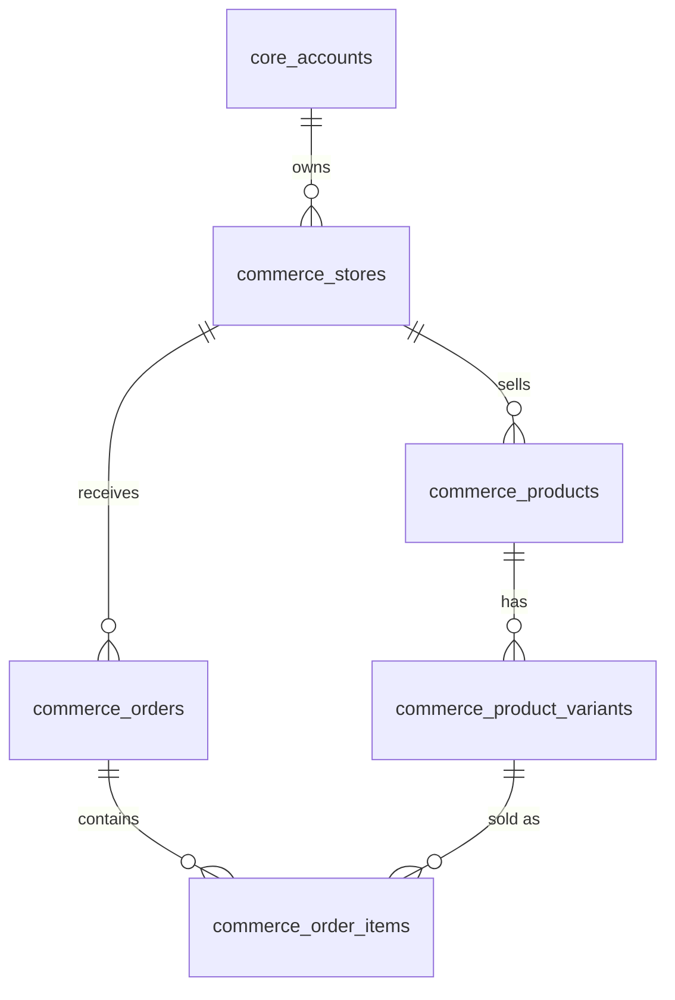

# Commerce Domain

## 1. What is this?
The Commerce Domain (`commerce_*` tables) acts as the system of record for inventory, products, variants, and orders synchronized from external platforms (like Shopify).

## 2. Why does it exist?
While AutoShipp's primary value is in the Fit Engine (`fit` schema), it requires a normalized, local copy of commerce data to run ML models, assign recommendations, and track conversions.

## 3. Important Entities
- **`commerce_stores`**: Represents a physical or digital storefront (e.g., a specific Shopify URL). Belongs to a `core_account`.
- **`commerce_products`**: The parent product (e.g., "Men's T-Shirt").
- **`commerce_product_variants`**: The specific SKU (e.g., "Men's T-Shirt - Blue - Large").
- **`commerce_orders` & `commerce_order_items`**: Tracks purchases. Crucial for the Fit Engine to calculate recommendation accuracy (did the user keep the recommended size or return it?).

## 4. Relationship Overview

## 5. Important Constraints & Usage
- **External IDs:** Most commerce tables have an `external_id` (e.g., the Shopify Product ID). This is usually indexed for fast upserts during webhook syncs.
- **Authoritative vs Derivative:** These tables are **Canonical** for the platform, but they are **Derivatives** of Shopify. Do not manually update product names here; wait for the Shopify webhook to sync.

## 6. How new developers should use these tables
- When querying for "Products", always join `commerce_products` to `commerce_product_variants` because inventory and sizing (which the Fit Engine cares about) live on the Variant.
- Use these tables to verify the state of the catalog if the Fit Engine seems out of sync.

## 7. Common Mistakes
- Forgetting to scope searches by `account_id` and `store_id`. `external_id` is only unique *per store*, not globally!