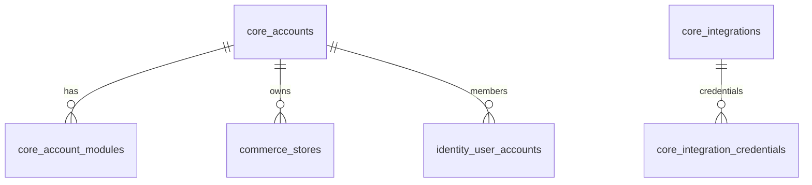

# Core Infrastructure Domain

## 1. What is this?
The Core Infrastructure domain (`core_*` tables) is the bedrock of the AutoShipp platform. It defines the multi-tenant boundaries (Accounts), integrations (Shopify, ERPs), and system modules that power the rest of the schemas.

## 2. Why does it exist?
Every piece of business data in AutoShipp belongs to a tenant. The `core_accounts` table is the root of the entire data hierarchy. Without this domain, tenant data would bleed together.

## 3. Important Entities
- **`core_accounts`**: The root tenant entity. Every commerce store, product, and customer belongs to an account.
- **`core_account_types`**: Dictates the subscription/tier of the account.
- **`core_integrations` / `core_integration_credentials`**: Manages API keys and OAuth tokens for external systems (e.g., Shopify).
- **`core_system_modules` & `core_account_modules`**: Toggles features on/off per tenant.

## 4. Relationship Overview


## 5. Important JSON Fields & Constraints
- `core_integration_credentials` contains masked tokens. **NEVER** expose the `payload` or `access_token` column in raw logs.
- `account_id` is a UUID. It serves as the physical foreign key for `public` schema tables and the *logical* foreign key for `fit` schema tables.

## 6. How new developers should use these tables
- **DO NOT** create a new tenant manually via SQL. Use the Application API to ensure default configurations (`fit_tenant_configs`) are bootstrapped.
- **DO** join against `core_accounts` when writing multi-tenant reporting queries.

## 7. Common Queries
**Find all integrations for an account:**
```sql
SELECT i.name, c.status 
FROM core_integrations i
JOIN core_integration_credentials c ON c.integration_id = i.id
WHERE c.account_id = 'uuid';
```