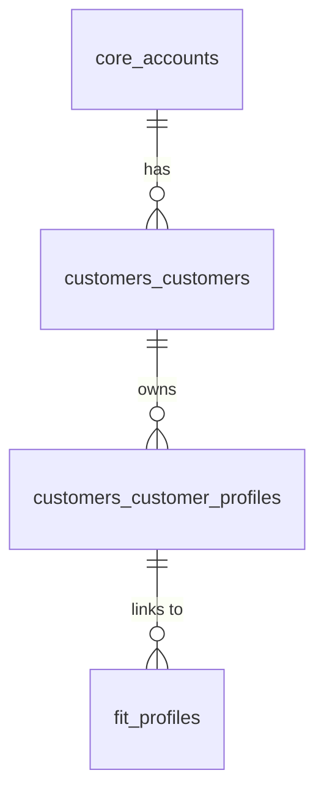

# Customer Domain

## 1. What is this?
The Customer Domain tracks the end-shoppers (buyers) of the tenants' stores. 

## 2. Why does it exist?
The platform needs to uniquely identify shoppers returning to a store to attach their historical Fit Profiles (measurements) to them, bypassing the need to ask for their height/weight every single time.

## 3. Important Entities
- **`customers_customers`**: The root identity of a shopper for a specific tenant.
- **`customers_customer_profiles`**: Links a shopper to one or more physical profiles (e.g. they might shop for themselves, and their spouse).

## 4. Relationship Overview

## 5. Important JSON Fields & Constraints
- `customers_customers` does not store plaintext passwords for shoppers. Auth is usually delegated to Shopify or handled via magic links, which are short-lived tokens in Redis, not Postgres.
- `external_id` maps to the Shopify Customer ID.

## 6. Common Mistakes
- Confusing `identity_users` with `customers_customers`. `identity_users` are the *merchants* logging into the AutoShipp dashboard. `customers_customers` are the *shoppers* buying clothes on the Shopify storefront.