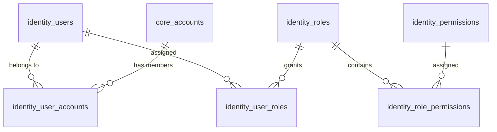

# Identity & RBAC Domain

## 1. What is this?
The Identity domain (`identity_*` tables) handles Authentication (AuthN) and Role-Based Access Control (RBAC). It dictates who can log into the platform and what they can do within specific Accounts.

## 2. Why does it exist?
AutoShipp allows users to belong to multiple Accounts (e.g., an agency managing multiple Shopify stores). Therefore, a User is decoupled from an Account via a many-to-many relationship.

## 3. Important Entities
- **`identity_users`**: Global user records (email, password hashes, global status).
- **`identity_user_accounts`**: The bridge mapping a user to a tenant account.
- **`identity_roles` & `identity_permissions`**: The defined roles (e.g., 'Admin', 'Viewer') and atomic permissions.
- **`identity_user_roles`**: Assigns a role to a user *within the context of a specific account*.

## 4. Relationship Overview

## 5. Important Constraints & JSON Fields
- **Composite Unique Keys:** `identity_user_roles` has a unique constraint on `(user_id, role_id, account_id)` to prevent duplicate role assignments.
- `identity_users.password_hash` uses bcrypt. Never log this field.

## 6. Business Workflow (Login to Authorization)
1. User authenticates against `identity_users`.
2. UI fetches available accounts via `identity_user_accounts`.
3. User selects Account A.
4. API fetches permissions by joining `identity_user_roles` -> `identity_roles` -> `identity_role_permissions` filtered by `account_id = A`.

## 7. Common Mistakes
- Assigning a role to a user *without* specifying the `account_id`. Roles are almost always tenant-scoped, not global.
- Deleting a user directly. **Always use soft deletes** (`is_active = false` or `deleted_at`) to preserve audit history in the `fit_governance_audit_events` table.