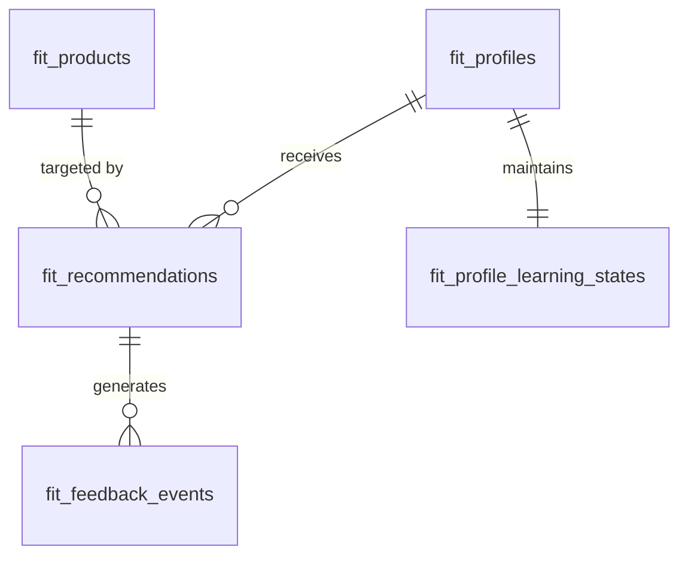

# Fit Engine Domain

## 1. What is this?

The Fit Engine is the core intellectual property of the AutoShipp platform. Residing in the `fit` schema, it handles machine learning recommendations, sizing charts, user fit profiles, and historical sizing data.

## 2. Why does it exist?

While the `public` schema tracks _what_ a product is (Commerce), the `fit` schema calculates _how_ it fits a specific person. It decouples complex AI/ML data from standard transactional commerce data.

## 3. Important Entities

- **`fit_products`**: An ML-enriched projection of `public.commerce_products`. Contains normalized sizing metadata (e.g., extracting "Large" from "Men's Blue Shirt - L").
- **`fit_profiles` & `fit_profile_learning_states`**: The core data structure representing an end-shopper's bodily dimensions and historical fit preferences.
- **`fit_recommendations`**: The actual size recommended to a shopper at a given point in time.
- **`fit_feedback_events`**: Did the recommendation work? User feedback (Too small, Too big, Perfect) that feeds back into the ML models.
- **`fit_size_charts`**: The mathematical mapping of garment dimensions to standard sizes.

## 4. Relationship Overview

## 5. Important JSON Fields

- **`fit_products.metadata`**: Often contains raw HTML or tags synced from Shopify used by NLP to extract sizing context.
- **`fit_profiles.measurements`**: A JSONB blob representing dynamic 3D body measurements. This schema evolves rapidly, hence the JSONB column instead of rigid relational columns.

## 6. How new developers should use these tables

- **DO NOT** use `fit_products` to display storefront data. It is for internal model processing. Use `public.commerce_products` for storefront display.
- **DO** index heavily on `account_id` and `customer_id` within `fit_profiles` for fast storefront retrieval during live recommendations.

## 7. Known Issues & Common Mistakes

- **Canonical vs Legacy**: There are old `fit_*` tables sitting in the `public` schema. **Do not use them**. They are deprecated. Only read from the `fit.*` schema.
- **Tenant Isolation**: The `fit` schema tables use `account_id` for scoping, but there is NO physical foreign key linking back to `public.core_accounts`. You must enforce this logically in your application queries.
