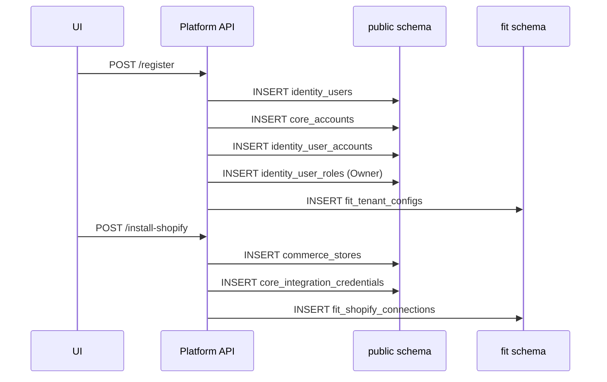

# Workflow: Account Onboarding

## 1. What is this workflow?

When a new brand signs up for AutoShipp, the system must provision their global account, set up their identity credentials, bootstrap their Fit Engine configurations, and establish the Shopify integration links.

## 2. Step-by-Step Explanation

1. **User Registration**
   - The user signs up via the UI.
   - Insert into `public.identity_users`.

2. **Account Provisioning**
   - A new tenant boundary is created.
   - Insert into `public.core_accounts`.
   - Insert into `public.identity_user_accounts` linking the User to the Account.

3. **RBAC Bootstrap**
   - The user is granted the "Owner" role for this specific account.
   - Insert into `public.identity_user_roles` (`user_id`, `role_id` [Owner], `account_id`).

4. **Fit Engine Bootstrap**
   - The Fit engine requires baseline configuration before accepting traffic.
   - Insert into `fit.fit_tenant_configs` matching the `core_accounts.id`.

5. **Integration Handshake**
   - The user installs the Shopify app.
   - Insert into `public.commerce_stores` representing the Shopify storefront.
   - Insert into `public.core_integrations` and `public.core_integration_credentials` to store the Shopify Access Tokens safely.
   - Insert into `fit.fit_shopify_connections` to notify the intelligence engine that webhook syncing should commence.

## 3. Data Flow Diagram

## 4. Important Constraints & Indexes

- The system heavily relies on `core_accounts.id` propagating correctly. If `fit_tenant_configs` fails to insert, the Fit Engine will throw 500s for this account. This entire flow should be wrapped in a **database transaction** to prevent orphaned accounts.
