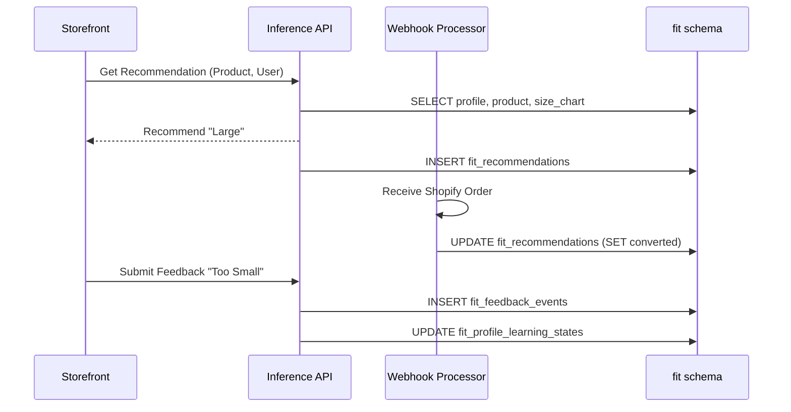

# Workflow: Fit Recommendation Lifecycle

## 1. What is this workflow?

This is the core value proposition of the platform. A shopper visits a product page, the storefront requests a size recommendation, the engine calculates it, and the user eventually buys and provides feedback.

## 2. Step-by-Step Explanation

1. **Inference Request**
   - Storefront JS hits the API: "Shopper A is viewing Product B".
   - API loads `fit.fit_profiles` for Shopper A.
   - API loads `fit.fit_products` and `fit.fit_size_charts` for Product B.

2. **Recommendation Generation**
   - ML model computes the best size.
   - Insert into `fit.fit_recommendations` (status: `served`).

3. **Purchase Conversion**
   - A Shopify Webhook fires for `orders/create`.
   - The system checks if the order contains Product B.
   - If yes, update `fit.fit_recommendations` (status: `converted`).

4. **Feedback Collection**
   - Post-purchase email asks "How did it fit?"
   - User clicks "Too Small".
   - Insert into `fit.fit_feedback_events` linking back to the `recommendation_id`.
   - Update `fit.fit_profile_learning_states` to bump their size preference slightly larger.

## 3. Data Flow Diagram

