# AutoShipp — Architecture & ER Diagram Reference (Clean Mermaid Edition)

> Rebuilt from the original "Full Architecture Diagram & ER Catalog". Every diagram below is valid **Mermaid** syntax — it renders as an interactive graph in Obsidian (with the core Mermaid plugin, which ships by default), GitHub, and most modern markdown viewers, **and** it parses cleanly as structured text for an AI agent (consistent node IDs, explicit edges, no ASCII-art line-wrapping to misread).
>
> Node ID convention: `AES-0xx` = spec documents, everything else uses short camel/snake IDs matching the real table/service name so an agent can grep for them.

---

## Part 1 — AES Document Dependency Graph

This is the master "who-references-whom" graph across all 44 specs. Same data as the original, just reformatted for readability (one edge per line, grouped, no stray whitespace).

```mermaid
graph TD
    AES-000["AES-000<br/>Engineering Constitution"]
    AES-001["AES-001<br/>Vision & Strategic Goals"]
    AES-002["AES-002<br/>Architecture Principles"]
    AES-003["AES-003<br/>Business Model"]
    AES-004["AES-004<br/>Organization Domain Model"]
    AES-005["AES-005<br/>IAM Domain"]
    AES-006["AES-006<br/>Marketplace & Licensing Domain"]
    AES-007["AES-007<br/>Database Architecture & Ownership"]
    AES-008["AES-008<br/>Master Database Blueprint"]
    AES-009["AES-009<br/>Identity Schema"]
    AES-010["AES-010<br/>Organization Schema"]
    AES-011["AES-011<br/>Commerce Schema"]
    AES-012["AES-012<br/>Marketplace & Catalog Schema"]
    AES-013["AES-013<br/>Billing Schema"]
    AES-014["AES-014<br/>Wallet & Credits Schema"]
    AES-015["AES-015<br/>Integration Schema"]
    AES-016["AES-016<br/>Customer Domain Schema"]
    AES-017["AES-017<br/>Audit & Activity Schema"]
    AES-018["AES-018<br/>Notification Schema"]
    AES-019["AES-019<br/>Feature Flags & Runtime Config"]
    AES-020["AES-020<br/>Platform API Architecture"]
    AES-021["AES-021<br/>Event-Driven Architecture"]
    AES-022["AES-022<br/>Background Jobs & Workers"]
    AES-023["AES-023<br/>Health, Monitoring & Observability"]
    AES-024["AES-024<br/>Logging & Distributed Tracing"]
    AES-025["AES-025<br/>Binary Asset Strategy"]
    AES-026["AES-026<br/>Deployment & DevOps"]
    AES-027["AES-027<br/>Redis, Caching & Locking"]
    AES-028["AES-028<br/>Security & Compliance"]
    AES-029["AES-029<br/>Multi-Tenant Isolation"]
    AES-030["AES-030<br/>Frontend Architecture"]
    AES-031["AES-031<br/>Disaster Recovery & BCP"]
    AES-032["AES-032<br/>DB Operations & Migration Governance"]
    AES-033["AES-033<br/>Performance & Capacity Planning"]
    AES-034["AES-034<br/>Testing, QA & Release Validation"]
    AES-035["AES-035<br/>Master Architecture Summary / ADR"]
    AES-036["AES-036<br/>Transactional Outbox"]
    AES-037["AES-037<br/>Subscription Lifecycle & Revocation"]
    AES-038["AES-038<br/>Sync & Conflict Resolution"]
    AES-039["AES-039<br/>Multi-Org Session Model"]
    AES-040["AES-040<br/>DB Graduation & Service Extraction"]
    AES-041["AES-041<br/>API Versioning & Contract Evolution"]
    AES-042["AES-042<br/>Enterprise Ops & Compliance"]
    AES-043["AES-043<br/>AutoShipp Intelligence Platform"]

    %% Foundation layer
    AES-001 --> AES-000
    AES-000 --> AES-001
    AES-002 --> AES-000
    AES-002 --> AES-001
    AES-002 --> AES-003
    AES-001 --> AES-002
    AES-003 --> AES-000
    AES-003 --> AES-001
    AES-003 --> AES-002
    AES-003 --> AES-004
    AES-004 --> AES-000
    AES-004 --> AES-001
    AES-004 --> AES-002
    AES-004 --> AES-003
    AES-004 --> AES-005

    %% Domain layer
    AES-005 --> AES-000
    AES-005 --> AES-001
    AES-005 --> AES-002
    AES-005 --> AES-003
    AES-005 --> AES-004
    AES-005 --> AES-006
    AES-006 --> AES-000
    AES-006 --> AES-001
    AES-006 --> AES-002
    AES-006 --> AES-003
    AES-006 --> AES-004
    AES-006 --> AES-005
    AES-006 --> AES-007
    AES-007 --> AES-000
    AES-007 --> AES-001
    AES-007 --> AES-002
    AES-007 --> AES-003
    AES-007 --> AES-004
    AES-007 --> AES-005
    AES-007 --> AES-006
    AES-007 --> AES-008
    AES-007 --> AES-009
    AES-007 --> AES-010
    AES-007 --> AES-011

    %% Master blueprint + schemas
    AES-008 --> AES-000
    AES-008 --> AES-001
    AES-008 --> AES-002
    AES-008 --> AES-003
    AES-008 --> AES-004
    AES-008 --> AES-005
    AES-008 --> AES-006
    AES-008 --> AES-007
    AES-008 --> AES-009
    AES-009 --> AES-005
    AES-009 --> AES-007
    AES-009 --> AES-008
    AES-009 --> AES-010
    AES-010 --> AES-004
    AES-010 --> AES-008
    AES-010 --> AES-009
    AES-011 --> AES-002
    AES-011 --> AES-007
    AES-011 --> AES-008
    AES-011 --> AES-010
    AES-012 --> AES-003
    AES-012 --> AES-006
    AES-012 --> AES-008
    AES-012 --> AES-010
    AES-013 --> AES-003
    AES-013 --> AES-006
    AES-013 --> AES-008
    AES-013 --> AES-010
    AES-013 --> AES-012
    AES-014 --> AES-010
    AES-014 --> AES-012
    AES-014 --> AES-013
    AES-014 --> AES-022
    AES-015 --> AES-008
    AES-015 --> AES-010
    AES-015 --> AES-011
    AES-015 --> AES-013
    AES-016 --> AES-008
    AES-016 --> AES-010
    AES-016 --> AES-011
    AES-017 --> AES-008
    AES-017 --> AES-009
    AES-017 --> AES-010
    AES-018 --> AES-008
    AES-018 --> AES-009
    AES-018 --> AES-010
    AES-018 --> AES-015
    AES-018 --> AES-017
    AES-019 --> AES-008
    AES-019 --> AES-010
    AES-019 --> AES-012
    AES-019 --> AES-017

    %% Platform services
    AES-020 --> AES-008
    AES-020 --> AES-009
    AES-020 --> AES-010
    AES-020 --> AES-011
    AES-020 --> AES-012
    AES-020 --> AES-013
    AES-020 --> AES-014
    AES-020 --> AES-015
    AES-020 --> AES-016
    AES-020 --> AES-017
    AES-020 --> AES-018
    AES-020 --> AES-019
    AES-020 --> AES-028
    AES-021 --> AES-008
    AES-021 --> AES-020
    AES-022 --> AES-020
    AES-022 --> AES-021
    AES-023 --> AES-020
    AES-023 --> AES-021
    AES-023 --> AES-022
    AES-024 --> AES-017
    AES-024 --> AES-020
    AES-024 --> AES-021
    AES-024 --> AES-022
    AES-024 --> AES-023
    AES-025 -. asset strategy .-> AES-026
    AES-026 --> AES-020
    AES-026 --> AES-021
    AES-026 --> AES-022
    AES-026 --> AES-023
    AES-026 --> AES-024
    AES-026 --> AES-025
    AES-026 --> AES-032
    AES-027 --> AES-020
    AES-027 --> AES-021
    AES-027 --> AES-022
    AES-027 --> AES-023
    AES-027 --> AES-026

    %% Security / multi-tenant / frontend
    AES-028 --> AES-009
    AES-028 --> AES-017
    AES-028 --> AES-020
    AES-028 --> AES-021
    AES-028 --> AES-022
    AES-028 --> AES-024
    AES-028 --> AES-025
    AES-028 --> AES-026
    AES-028 --> AES-027
    AES-029 --> AES-009
    AES-029 --> AES-010
    AES-029 --> AES-011
    AES-029 --> AES-012
    AES-029 --> AES-013
    AES-029 --> AES-020
    AES-029 --> AES-028
    AES-030 --> AES-009
    AES-030 --> AES-010
    AES-030 --> AES-012
    AES-030 --> AES-019
    AES-030 --> AES-020
    AES-030 --> AES-028
    AES-030 --> AES-029

    %% Operational maturity
    AES-031 --> AES-008
    AES-031 --> AES-020
    AES-031 --> AES-022
    AES-031 --> AES-023
    AES-031 --> AES-025
    AES-031 --> AES-026
    AES-032 --> AES-008
    AES-032 --> AES-020
    AES-032 --> AES-026
    AES-032 --> AES-029
    AES-032 --> AES-031
    AES-033 --> AES-020
    AES-033 --> AES-021
    AES-033 --> AES-022
    AES-033 --> AES-023
    AES-033 --> AES-024
    AES-033 --> AES-026
    AES-033 --> AES-027
    AES-033 --> AES-029
    AES-034 --> AES-020
    AES-034 --> AES-021
    AES-034 --> AES-022
    AES-034 --> AES-024
    AES-034 --> AES-026
    AES-034 --> AES-028
    AES-034 --> AES-033

    %% Cross-cutting specs
    AES-036 --> AES-008
    AES-036 --> AES-019
    AES-036 --> AES-020
    AES-036 --> AES-021
    AES-036 --> AES-022
    AES-036 --> AES-023
    AES-037 --> AES-012
    AES-037 --> AES-013
    AES-037 --> AES-014
    AES-037 --> AES-016
    AES-037 --> AES-021
    AES-037 --> AES-022
    AES-037 --> AES-036
    AES-038 --> AES-011
    AES-038 --> AES-015
    AES-038 --> AES-021
    AES-038 --> AES-022
    AES-038 --> AES-036
    AES-039 --> AES-009
    AES-039 --> AES-020
    AES-039 --> AES-028
    AES-039 --> AES-029
    AES-039 --> AES-030
    AES-040 --> AES-008
    AES-040 --> AES-020
    AES-040 --> AES-021
    AES-040 --> AES-031
    AES-040 --> AES-032
    AES-041 --> AES-020
    AES-041 --> AES-021
    AES-041 --> AES-030
    AES-042 --> AES-005
    AES-042 --> AES-009
    AES-042 --> AES-017
    AES-042 --> AES-024
    AES-042 --> AES-025
    AES-042 --> AES-028
    AES-042 --> AES-029
    AES-042 --> AES-031
    AES-042 --> AES-032
    AES-042 --> AES-037

    %% Master summary references everything
    AES-035 --> AES-001
    AES-035 --> AES-002
    AES-035 --> AES-003
    AES-035 --> AES-004
    AES-035 --> AES-005
    AES-035 --> AES-006
    AES-035 --> AES-007
    AES-035 --> AES-008
    AES-035 --> AES-009
    AES-035 --> AES-010
    AES-035 --> AES-011
    AES-035 --> AES-012
    AES-035 --> AES-013
    AES-035 --> AES-014
    AES-035 --> AES-015
    AES-035 --> AES-016
    AES-035 --> AES-017
    AES-035 --> AES-018
    AES-035 --> AES-019
    AES-035 --> AES-020
    AES-035 --> AES-021
    AES-035 --> AES-022
    AES-035 --> AES-023
    AES-035 --> AES-024
    AES-035 --> AES-025
    AES-035 --> AES-026
    AES-035 --> AES-027
    AES-035 --> AES-028
    AES-035 --> AES-029
    AES-035 --> AES-030
    AES-035 --> AES-031
    AES-035 --> AES-032
    AES-035 --> AES-033
    AES-035 --> AES-034
```

### Simplified layer view (the same graph, but grouped — read this one first)

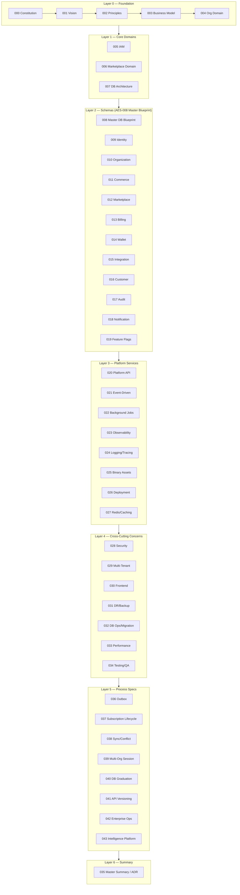

---

## Part 2 — Architecture & ER Diagrams by Spec

### AES-001 — Vision & Strategic Goals

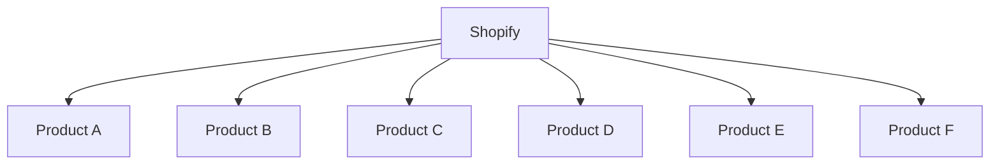

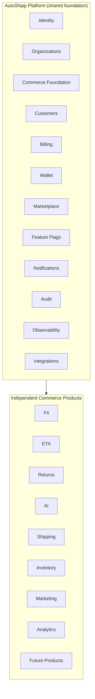

### AES-002 — Architecture Principles

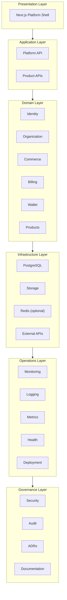

### AES-003 — Business Model

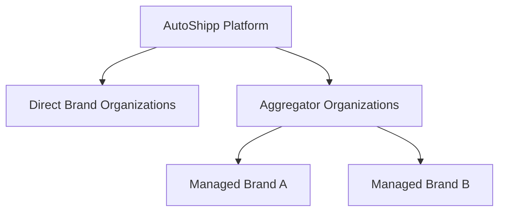

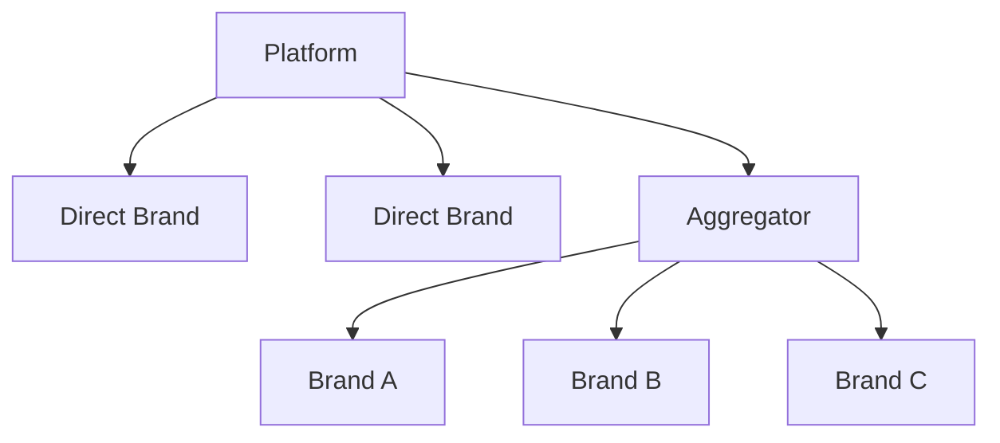

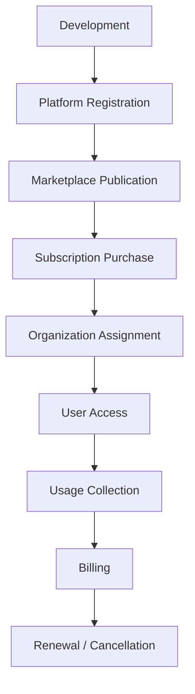

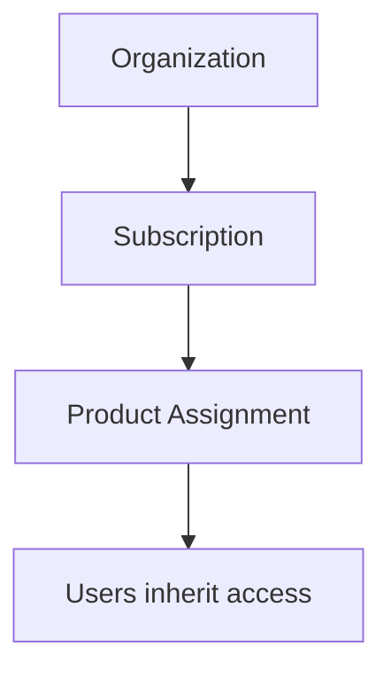

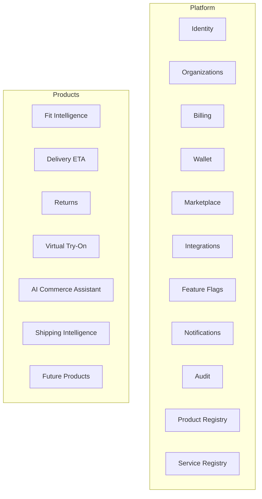

### AES-004 — Organization Domain Model

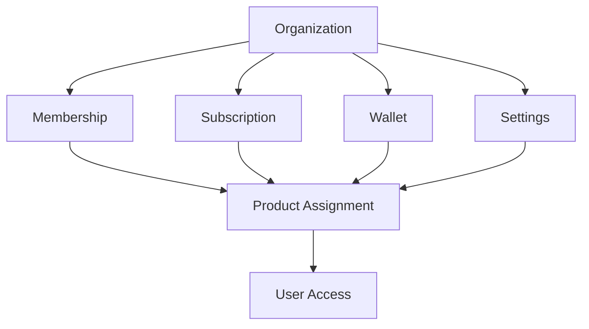

### AES-005 — Identity & Access Management (IAM) Domain

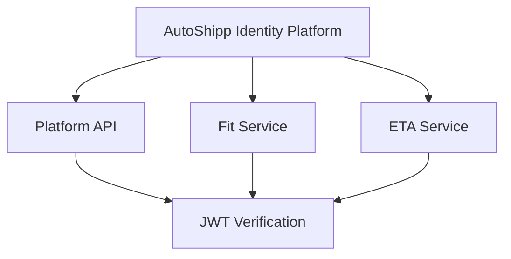

**Auth & user endpoints (reference, not a diagram):**

| Method | Path |
|---|---|
| POST | `/auth/login` |
| POST | `/auth/logout` |
| POST | `/auth/refresh` |
| GET | `/auth/me` |
| POST | `/auth/change-password` |
| POST | `/auth/forgot-password` |
| POST | `/auth/reset-password` |
| GET | `/users` |
| POST | `/users` |
| PATCH | `/users/{id}` |
| DELETE | `/users/{id}` |
| GET | `/users/{id}/sessions` |
| DELETE | `/sessions/{id}` |

### AES-006 — Product Marketplace & Licensing Domain

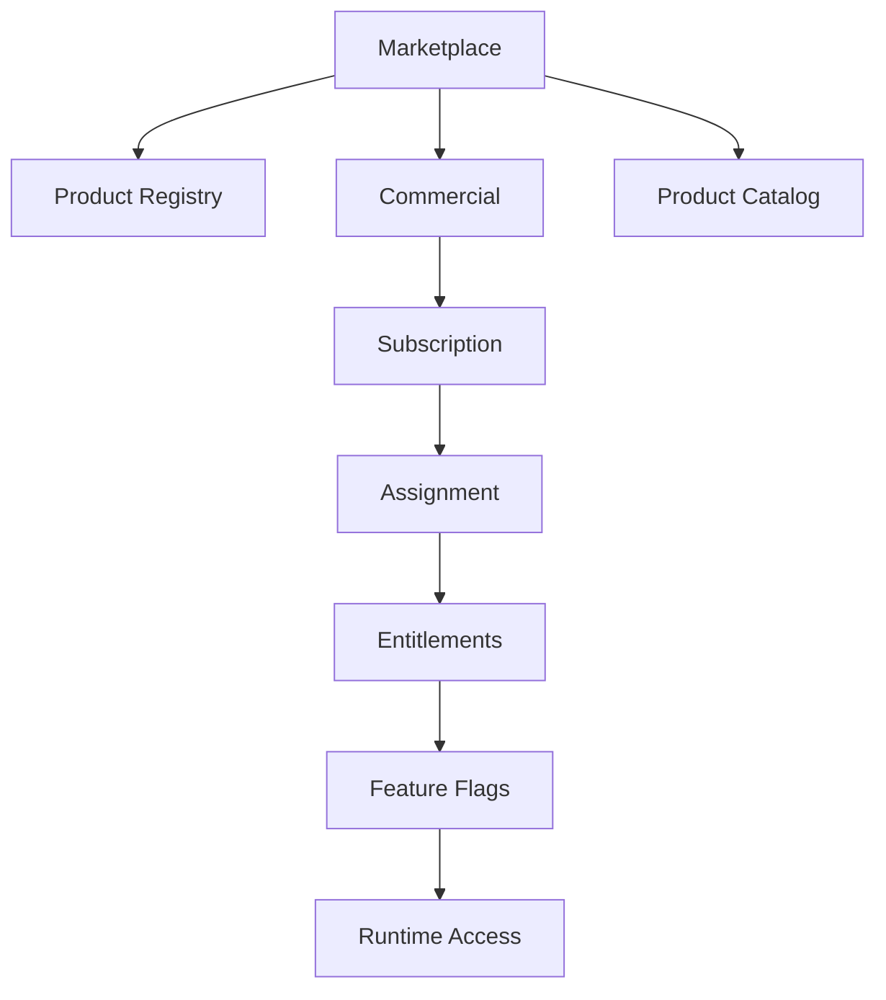

### AES-009 — Identity Schema Specification

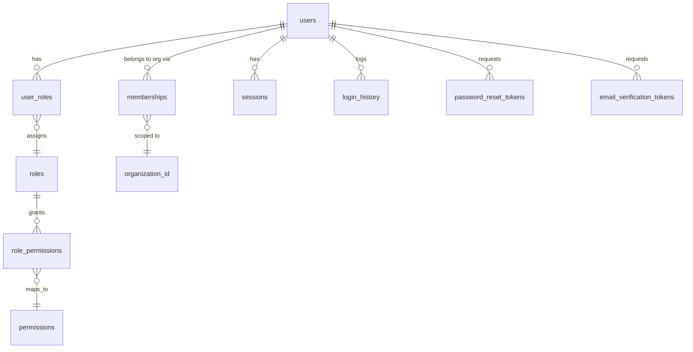

### AES-010 — Organization Schema Specification

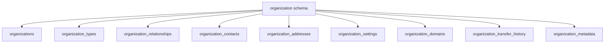

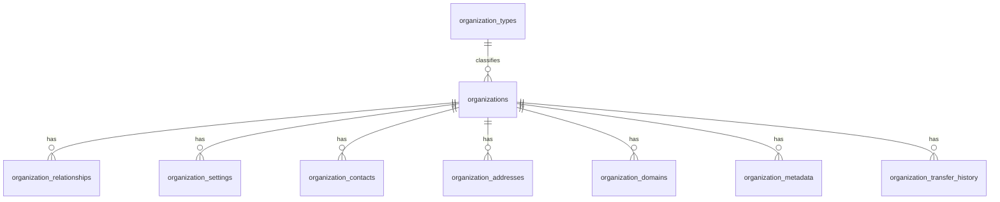

### AES-011 — Commerce Schema Specification

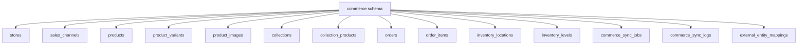

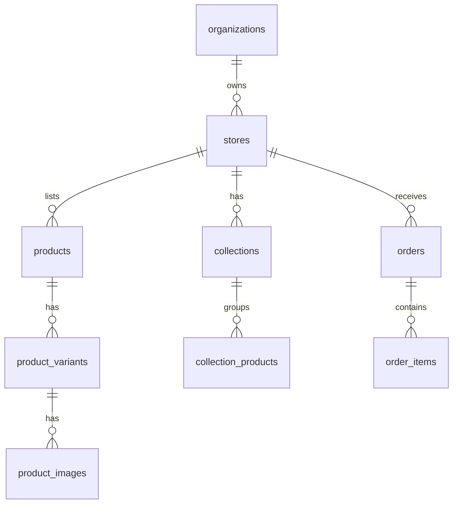

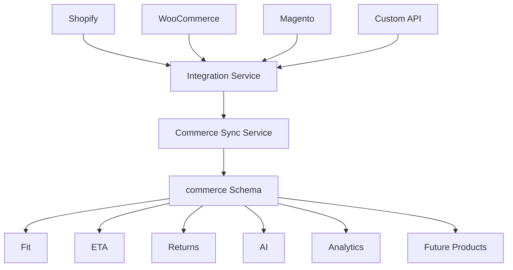

### AES-012 — Marketplace & Product Catalog Schema Specification

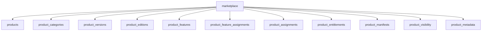

```mermaid
erDiagram
    product_categories ||--o{ products2 : classifies
    products2 ||--o{ product_versions : has
    products2 ||--o{ product_editions : has
    product_editions ||--o{ product_entitlements : grants
    products2 ||--o{ product_features : has
    product_features ||--o{ product_feature_assignments : assigned_via
    products2 ||--o{ product_assignments : has
    products2 ||--o{ product_manifests : has
    products2 ||--o{ product_metadata : has
```

### AES-013 — Billing Schema Specification

```mermaid
graph TD
    billing --> plans
    billing --> plan_prices
    billing --> subscriptions
    billing --> subscription_items
    billing --> invoices
    billing --> invoice_items
    billing --> payments
    billing --> payment_methods
    billing --> credit_notes
    billing --> taxes
    billing --> billing_events
    billing --> billing_metadata
```

```mermaid
erDiagram
    plans ||--o{ plan_prices : has
    plan_prices ||--o{ subscriptions : priced_for
    subscriptions ||--o{ subscription_items : contains
    subscriptions ||--o{ invoices : generates
    invoices ||--o{ invoice_items : contains
    invoices ||--o{ payments : settled_by
```

### AES-014 — Wallet & Credits Schema Specification

```mermaid
graph TD
    wallet --> wallets
    wallet --> wallet_transactions
    wallet --> wallet_transaction_types
    wallet --> wallet_balances
    wallet --> credit_packages
    wallet --> credit_purchases
    wallet --> wallet_adjustments
    wallet --> wallet_reservations
    wallet --> wallet_metadata
```

```mermaid
erDiagram
    organizations ||--o{ wallets : owns
    wallets ||--o{ wallet_transactions : records
    wallets ||--o{ wallet_balances : tracks
    wallets ||--o{ credit_purchases : has
    wallets ||--o{ wallet_adjustments : has
    wallets ||--o{ wallet_reservations : has
```

### AES-015 — Integration Schema Specification

```mermaid
graph TD
    integration --> provider_categories
    integration --> providers
    integration --> provider_versions
    integration --> organization_connections
    integration --> connection_credentials
    integration --> connection_settings
    integration --> webhooks
    integration --> webhook_events
    integration --> sync_jobs
    integration --> sync_logs
    integration --> rate_limit_usage
    integration --> provider_health
    integration --> oauth_tokens
    integration --> api_keys
    integration --> integration_metadata
```

```mermaid
erDiagram
    provider_categories ||--o{ providers : classifies
    providers ||--o{ provider_versions : has
    providers ||--o{ organization_connections : connects_to
    organization_connections ||--o{ connection_credentials : has
    organization_connections ||--o{ connection_settings : has
    organization_connections ||--o{ oauth_tokens : has
    organization_connections ||--o{ api_keys : has
    providers ||--o{ webhooks : exposes
    webhooks ||--o{ webhook_events : emits
    providers ||--o{ sync_jobs : runs
    sync_jobs ||--o{ sync_logs : produces
    providers ||--o{ provider_health : monitored_by
```

### AES-016 — Customer Domain Schema Specification

```mermaid
graph TD
    customer --> customers
    customer --> customer_addresses
    customer --> customer_contacts
    customer --> customer_tags
    customer --> customer_tag_assignments
    customer --> customer_segments
    customer --> customer_segment_memberships
    customer --> customer_preferences
    customer --> customer_external_mappings
    customer --> customer_merge_history
    customer --> customer_consents
    customer --> customer_metadata
```

```mermaid
erDiagram
    organizations ||--o{ customers : owns
    customers ||--o{ customer_addresses : has
    customers ||--o{ customer_contacts : has
    customers ||--o{ customer_preferences : has
    customers ||--o{ customer_consents : has
    customers ||--o{ customer_external_mappings : has
    customers ||--o{ customer_tags : tagged_with
    customer_tags ||--o{ customer_tag_assignments : assigned_via
    customers ||--o{ customer_segments : grouped_in
    customer_segments ||--o{ customer_segment_memberships : tracked_via
    customers ||--o{ customer_merge_history : has
```

### AES-017 — Audit & Activity Schema Specification

```mermaid
graph TD
    audit --> audit_events
    audit --> entity_changes
    audit --> login_events
    audit --> permission_events
    audit --> api_requests
    audit --> service_events
    audit --> activity_timeline
    audit --> correlation_traces
    audit --> archived_audit_events
    audit --> audit_metadata
```

```mermaid
erDiagram
    audit_events ||--o{ entity_changes : records
    audit_events ||--o{ login_events : records
    audit_events ||--o{ permission_events : records
    audit_events ||--o{ api_requests : records
    audit_events ||--o{ service_events : records
    audit_events ||--o{ correlation_traces : links_to
```

### AES-018 — Notification Schema Specification

```mermaid
graph TD
    notification --> notification_types
    notification --> notification_templates
    notification --> notification_channels
    notification --> notification_events
    notification --> notification_recipients
    notification --> notification_deliveries
    notification --> notification_preferences
    notification --> scheduled_notifications
    notification --> retry_queue
    notification --> delivery_logs
    notification --> provider_routes
    notification --> notification_metadata
```

```mermaid
erDiagram
    notification_types ||--o{ notification_templates : defines
    notification_templates ||--o{ notification_events : used_by
    notification_events ||--o{ notification_recipients : targets
    notification_events ||--o{ notification_deliveries : produces
    notification_deliveries ||--o{ delivery_logs : logged_in
    notification_deliveries ||--o{ retry_queue : retried_via
```

> Template sample: `Hello {{customer_name}} — Your order {{order_number}} has shipped.`

### AES-019 — Feature Flags & Runtime Configuration Schema Specification

```mermaid
graph TD
    feature_flag --> feature_flags
    feature_flag --> flag_environments
    feature_flag --> flag_product_overrides
    feature_flag --> flag_organization_overrides
    feature_flag --> flag_rollouts
    feature_flag --> runtime_configs
    feature_flag --> config_overrides
    feature_flag --> evaluation_logs
    feature_flag --> flag_change_history
    feature_flag --> feature_flag_metadata
```

```mermaid
erDiagram
    feature_flags ||--o{ flag_environments : has
    feature_flags ||--o{ flag_product_overrides : has
    feature_flags ||--o{ flag_organization_overrides : has
    feature_flags ||--o{ flag_rollouts : has
    feature_flags ||--o{ evaluation_logs : logged_in
    feature_flags ||--o{ flag_change_history : tracked_in
    runtime_configs ||--o{ config_overrides : has
```

### AES-020 — Platform API Architecture Specification

```mermaid
graph TD
    NextFrontend["Next.js Frontend"] --> JWTCookie["HttpOnly JWT Cookie"]
    JWTCookie --> PlatformAPI["Platform API (NestJS)"]
    PlatformAPI --> PlatformSchemas["Platform Schemas (PostgreSQL)"]
    PlatformAPI --> ProductAPIs["Product APIs (Fit/ETA/...)"]
    PlatformAPI --> Infra["Infrastructure (Redis/BullMQ)"]
```

### AES-021 — Event-Driven Architecture Specification

```mermaid
flowchart TD
    PlatformAPI["Platform API"] --> BizTxn["Business Transaction"]
    BizTxn --> OutboxPub["Outbox Publisher"]
    OutboxPub --> RedisBullMQ["Redis (BullMQ)"]
    RedisBullMQ --> AuditWorker["Audit Worker"]
    RedisBullMQ --> NotifWorker["Notification Worker"]
    RedisBullMQ --> BillingWorker["Billing Worker"]
    RedisBullMQ --> FutureWorkers["Future Workers"]
```

> Queue naming convention: `autoshipp:queue:<domain>`

### AES-022 — Background Jobs & Worker Architecture Specification

```mermaid
flowchart TD
    NextJS["Next.js"] --> HTTPReq["HTTP Request"]
    HTTPReq --> PlatformAPI2["Platform API"]
    PlatformAPI2 --> BizTxn2["Business Transaction"]
    BizTxn2 --> PublishEvent["Publish Event"]
    PublishEvent --> BullMQBroker["BullMQ Broker"]
    BullMQBroker --> NotifWorker2["Notification Worker"]
    BullMQBroker --> BillingWorker2["Billing Worker"]
    BullMQBroker --> SyncWorker2["Sync Worker"]
    BullMQBroker --> AuditWorker2["Audit Worker"]
    NotifWorker2 --> Database2["Database"]
    BillingWorker2 --> Database2
    SyncWorker2 --> Database2
```

> Event naming convention: `autoshipp.<domain>.<operation>`

### AES-023 — Platform Health, Monitoring & Observability Architecture Specification

```mermaid
graph TD
    Dashboard["Platform Dashboard"] --> HealthAgg["Health Aggregator API"]
    HealthAgg --> PlatformAPI3["Platform API"]
    HealthAgg --> WorkerAPIs["Worker APIs"]
    HealthAgg --> ProductAPIs3["Product APIs"]
    HealthAgg --> Infrastructure3["Infrastructure"]
    PlatformAPI3 --> HealthCollector["Health Collector"]
    WorkerAPIs --> HealthCollector
    ProductAPIs3 --> HealthCollector
    Infrastructure3 --> HealthCollector
    HealthCollector --> MetricsDB["Metrics Database"]
```

### AES-024 — Logging, Observability & Distributed Tracing Architecture Specification

```mermaid
flowchart TD
    Client --> HTTPRequest["HTTP Request"]
    HTTPRequest --> CorrelationID["Correlation ID"]
    CorrelationID --> PlatformAPI4["Platform API"]
    PlatformAPI4 --> Logs["Structured Logs"]
    PlatformAPI4 --> Metrics4["Metrics"]
    PlatformAPI4 --> Trace["Distributed Trace"]
    Logs --> ObsStack["Observability Stack"]
    Metrics4 --> ObsStack
    Trace --> ObsStack
    ObsStack --> Outputs["Logs • Metrics • Traces • Alerts"]
```

```mermaid
flowchart TD
    CreateOrg["User creates Organization"] --> AppLog["Application Log: 'Organization created successfully'"]
    CreateOrg --> MetricInc["Metric: organizations_created_total +1"]
    CreateOrg --> DistTrace["Distributed Trace: HTTP → DB → BullMQ → Notification"]
    CreateOrg --> AuditRecord["Audit Record: 'Platform Owner created Organization X'"]
```

### AES-026 — Deployment, Infrastructure & DevOps Architecture Specification

```mermaid
flowchart TD
    Internet --> Cloudflare
    Cloudflare --> Nginx["Nginx Reverse Proxy"]
    Nginx --> NextApp["Next.js (Frontend)"]
    Nginx --> PlatformAPI5["Platform API (NestJS)"]
    Nginx --> FutureAPIs["Future Product APIs (Fit, ETA, Returns...)"]
    NextApp --> EventBus["BullMQ Event Bus"]
    PlatformAPI5 --> EventBus
    EventBus --> NotifWorker3["Notification Worker"]
    EventBus --> BillingWorker3["Billing Worker"]
    EventBus --> IntegrationWorker3["Integration Worker"]
    NotifWorker3 --> Neon["Neon PostgreSQL (Multi-Schema)"]
    BillingWorker3 --> Neon
    IntegrationWorker3 --> Neon
    Neon --> RedisCache["Redis Cache"]
    RedisCache --> S3["S3 Compatible Storage"]
```

**Monorepo layout (reference, not a graph):**

```text
autoshipp/
├── apps/
│   ├── web/
│   ├── platform-api/
│   ├── worker-notification/
│   ├── worker-billing/
│   ├── worker-wallet/
│   ├── worker-audit/
│   ├── worker-sync/
│   ├── worker-import/
│   ├── worker-export/
│   ├── worker-cleanup/
│   └── worker-scheduler/
├── packages/
│   ├── prisma-platform/
│   ├── shared-types/
│   ├── shared-config/
│   ├── shared-auth/
│   ├── shared-events/
│   ├── shared-logger/
│   ├── shared-validation/
│   ├── shared-cache/
│   ├── shared-storage/
│   └── shared-sdk/
├── infrastructure/
│   ├── docker/
│   ├── nginx/
│   ├── scripts/
│   └── environments/
└── docs/
```

### AES-027 — Redis, Caching & Distributed Locking Architecture Specification

```mermaid
graph TD
    NextJS6["Next.js"] --> PlatformAPI6["Platform API"]
    PlatformAPI6 --> Postgres6["PostgreSQL (Source of Truth)"]
    PlatformAPI6 --> Redis6["Redis (Fast Cache)"]
    PlatformAPI6 --> BullMQ6["BullMQ (Async Queue)"]
```

> Cache key pattern: `autoshipp:<domain>:<entity>:<identifier>`
> Lock key pattern: `lock:<resource>:<id>`

### AES-029 — Multi-Tenant Architecture & Organization Isolation Specification

```mermaid
graph TD
    AutoShipp["AutoShipp (Platform Owner)"] --> DirectBrands["Direct Brands"]
    AutoShipp --> Aggregators["Shipping Aggregators"]
    Aggregators --> BrandA9["Brand A"]
    Aggregators --> BrandB9["Brand B"]
    BrandA9 --> BrandAUsers["Brand Users"]
    BrandB9 --> BrandBUsers["Brand Users"]
    DirectBrands --> DirectBrandUsers["Direct Brand Users"]
```

```mermaid
graph TD
    AutoShipp2["AutoShipp"] --> BrandA10["Brand A"]
    AutoShipp2 --> BrandB10["Brand B"]
    AutoShipp2 --> Shiprocket
    Shiprocket --> Nike
    Shiprocket --> Puma
    Shiprocket --> Adidas
```

### AES-030 — Frontend Architecture & UI Platform Specification

```mermaid
graph TD
    Browser --> NextJS16["Next.js 16"]
    NextJS16 --> ServerComponents["Server Components"]
    NextJS16 --> ClientComponents["Client Components"]
    NextJS16 --> ServerActions["Server Actions"]
    ServerComponents --> PlatformAPI7["Platform API"]
    ClientComponents --> PlatformAPI7
    ServerActions --> PlatformAPI7
    PlatformAPI7 --> AccountContext["Account Context"]
```

**Route groups / app folder layout (reference):**

```text
app/
├── (auth)
├── (platform)
├── (aggregator)
└── (brand)
```

```text
apps/web
├── app/
├── components/
├── features/
├── providers/
├── hooks/
├── services/
├── lib/
├── types/
├── styles/
├── middleware.ts
└── instrumentation.ts
```

### AES-031 — Disaster Recovery, Backup & Business Continuity Architecture Specification

```mermaid
graph TD
    Production --> PostgreSQL31["PostgreSQL"]
    Production --> ObjectStorage31["Object Storage"]
    Production --> Redis31["Redis"]
    PostgreSQL31 --> BackupStorage["Backup Storage"]
    ObjectStorage31 --> BackupStorage
    Redis31 --> BackupStorage
    BackupStorage --> RestoreProcess["Restore Process"]
    RestoreProcess --> DisasterRecovery["Disaster Recovery"]
```

### AES-032 — Database Operations, Migration & Schema Governance Specification

```mermaid
graph TD
    autoshipp["autoshipp (database)"] --> identity32["identity"]
    autoshipp --> organizations32["organizations"]
    autoshipp --> commerce32["commerce"]
    autoshipp --> marketplace32["marketplace"]
    autoshipp --> billing32["billing"]
    autoshipp --> wallet32["wallet"]
    autoshipp --> integrations32["integrations"]
    autoshipp --> customers32["customers"]
    autoshipp --> notifications32["notifications"]
    autoshipp --> audit32["audit"]
    autoshipp --> feature_flags32["feature_flags"]
    autoshipp --> runtime32["runtime"]
```

### AES-033 — Performance, Scalability & Capacity Planning Architecture Specification

```mermaid
graph TD
    Cloudflare33["Cloudflare"] --> LB33["Load Balancer (Nginx)"]
    LB33 --> API1["Platform API"]
    LB33 --> API2["Platform API"]
    LB33 --> API3["Platform API"]
    API1 --> Postgres33["PostgreSQL"]
    API2 --> Redis33["Redis"]
    API3 --> BullMQ33["BullMQ"]
    Postgres33 --> NotifWorkers33["Notification Workers"]
    Redis33 --> BillingWorkers33["Billing Workers"]
    BullMQ33 --> IntegrationWorkers33["Integration Workers"]
```

```mermaid
sequenceDiagram
    participant P as Publisher
    participant Q as BullMQ
    participant C as Consumer
    P->>Q: Publish
    Q->>C: Deliver job
    C-->>Q: ACK
    Note over P,C: Target: < 2 seconds end-to-end
```

### AES-035 — Master Architecture Summary & Final Architecture Decision Record

```mermaid
graph TD
    AutoShippPlatform["AutoShipp Platform"] --> NextJS35["Next.js"]
    NextJS35 --> PlatformAPI35["Platform API"]
    PlatformAPI35 --> Postgres35["PostgreSQL"]
    PlatformAPI35 --> BullMQ35["BullMQ"]
    PlatformAPI35 --> Redis35["Redis"]
    Postgres35 --> BackgroundWorkers["Background Workers"]
    BullMQ35 --> BackgroundWorkers
    Redis35 --> BackgroundWorkers
    BackgroundWorkers --> S3_35["S3 Compatible Object Storage"]
    S3_35 --> FutureServices["Future Product Services"]
```

### AES-036 — Transactional Outbox Specification

```mermaid
flowchart TD
    Start(["Loop every 500ms"]) --> Begin["BEGIN TRANSACTION"]
    Begin --> Select["SELECT id, event_id, event_name, payload
FROM platform.outbox_events
WHERE published = FALSE
AND scheduled_at <= NOW()
AND attempts < 5
ORDER BY created_at ASC
LIMIT 50
FOR UPDATE SKIP LOCKED"]
    Select --> ForEach{"For each record"}
    ForEach -->|"Job queued OK"| MarkPublished["UPDATE outbox_events
SET published = TRUE, published_at = NOW()"]
    ForEach -->|"Error / timeout"| MarkFailed["UPDATE outbox_events
SET attempts = attempts + 1, last_error = '<reason>'"]
    MarkPublished --> Commit["COMMIT"]
    MarkFailed --> Commit
    Commit --> Start
    MarkFailed -.->|"attempts = 5"| DeadLetter["outbox_events.published stays FALSE
last_error = 'Max attempts exceeded'"]
```

### AES-037 — Subscription Lifecycle & Access Revocation Specification

```mermaid
sequenceDiagram
    participant S as BullMQ Scheduler (06:00 daily)
    participant DB as billing.subscriptions
    participant O as Outbox

    S->>S: Run job lifecycle.check_expired_grace_periods
    S->>DB: SELECT * WHERE status='GRACE_PERIOD' AND grace_period_ends_at < NOW()
    DB-->>S: Expired subscriptions
    loop for each expired subscription
        S->>O: Emit billing.subscription.grace_period_expired
    end
```

### AES-039 — Multi-Organization Session Model Specification

```mermaid
sequenceDiagram
    participant U as User
    participant FE as Frontend
    participant API as Platform API
    participant DB as sessions table

    U->>FE: Click "Switch Organization"
    FE->>API: POST /auth/switch-organization { targetOrganizationId }
    Note over API: Auth: current valid JWT cookie
    API->>API: 1. Validate current JWT
    API->>API: 2. Verify ACTIVE membership in target org
    API->>API: 3. Verify target org is ACTIVE
    API->>API: Issue new JWT (active_organization_id = target, new token_version, old token NOT revoked)
    API->>DB: UPDATE last_active_organization_id = target
    API-->>FE: Return new HttpOnly JWT cookie
    FE->>FE: Rebuild Account Context
    FE->>FE: Rebuild Navigation for new organization
```

### AES-040 — Database Graduation & Service Extraction Strategy

Graduation triggers (any one met → candidate for service extraction):

```mermaid
graph LR
    T1[">300 write ops/sec sustained"] --> Graduate["Schema graduates to its own service"]
    T2[">500 GB stored"] --> Graduate
    T3[">20% of total DB CPU"] --> Graduate
    T4[">30% of connection pool"] --> Graduate
```

### AES-041 — API Versioning & Contract Evolution Specification

> URL pattern: `/api/v{MAJOR}`

```text
openapi/
├── v1/
│   └── openapi.yaml
├── v2/
│   └── openapi.yaml
└── current → symlink to latest stable
```

### AES-042 — Enterprise Operations & Compliance Specification

```mermaid
flowchart TD
    Start42(["User erasure request"]) --> Pseudo["Pseudonymize PII in identity.users
email → deleted_<uuid>@deleted.autoshipp.in
first_name → 'Deleted', last_name → 'User'
phone → NULL, avatar_url → NULL"]
    Pseudo --> Retain["Retain identity.users row (FK integrity + audit)"]
    Retain --> Revoke["Revoke all sessions (token_version += 999)"]
    Revoke --> Archive["Mark identity.users.status = ARCHIVED"]
    Archive --> RetainAudit["Retain audit.logs unchanged (legal obligation)"]
    RetainAudit --> RetainInvoices["Retain billing.invoices unchanged (financial record)"]
    RetainInvoices --> Emit["Emit identity.user.erased event"]
    Emit --> LogErasure["Log erasure in audit.logs with consent reference"]
```

**Compliance export request shape:**

```json
POST /platform/compliance/export
{
  "type": "SOC2_EVIDENCE",
  "startDate": "2026-01-01",
  "endDate": "2026-12-31",
  "scopes": ["access_reviews", "login_history", "audit_logs"]
}
```

### AES-043 — AutoShipp Intelligence Platform

```mermaid
graph TD
    Intelligence["AutoShipp Intelligence Platform"] --> WebsiteIntel["Website Intelligence"]
    WebsiteIntel --> Playwright["Playwright Crawler"]
    WebsiteIntel --> Lighthouse["Lighthouse Analyzer"]
    WebsiteIntel --> SEO["SEO Analyzer"]
    WebsiteIntel --> SecurityScanner["Security Scanner"]

    Intelligence --> CommerceIntel["Commerce Intelligence"]
    CommerceIntel --> ShopifyCollector["Shopify Collector (via Commerce Sync)"]
    CommerceIntel --> MetricsEngine["Metrics Engine"]
    CommerceIntel --> CustomerAnalytics["Customer Analytics"]
    CommerceIntel --> InventoryAnalytics["Inventory Analytics"]

    Intelligence --> AIIntel["AI Intelligence"]
    AIIntel --> LLMOrchestrator["LLM Orchestrator"]
    AIIntel --> RecommendationEngine["Recommendation Engine"]
    AIIntel --> ROIEngine["ROI Engine"]
    AIIntel --> BenchmarkEngine["Benchmark Engine"]
    AIIntel --> ExecReportGen["Executive Report Generator"]
    AIIntel --> OpportunityDetector["Opportunity Detector"]

    Intelligence --> Scheduler["Intelligence Scheduler (BullMQ)"]
    Scheduler --> InitialScan["Initial Scan"]
    Scheduler --> WeeklyScan["Weekly Scan"]
    Scheduler --> MonthlyAudit["Monthly Audit"]
    Scheduler --> ManualScan["Manual Scan"]
```

---

## Notes for your agent

- Every diagram is a fenced ```` ```mermaid ```` block with `graph TD`, `erDiagram`, `flowchart TD`, or `sequenceDiagram` — these are the four syntaxes Mermaid supports, so any tool that can parse Mermaid (including most coding agents) can extract nodes/edges programmatically.
- Node IDs are unique, ASCII, and match real table/service names where possible (e.g. `organizations`, `wallets`, `PlatformAPI`) — safe to grep/regex against.
- `erDiagram` blocks are used specifically where the source was a table/foreign-key relationship list, so they carry semantic relationship labels (`||--o{`, etc.) instead of generic arrows — this is the same data Part-1's dependency graph encodes for specs.
- Part 1's full dependency graph is large (44 nodes, ~300 edges) — Obsidian's graph view will look tangled at that scale by design; the "Simplified layer view" right under it is the one to read for a mental model, and the full one is there for exhaustive lookups.
